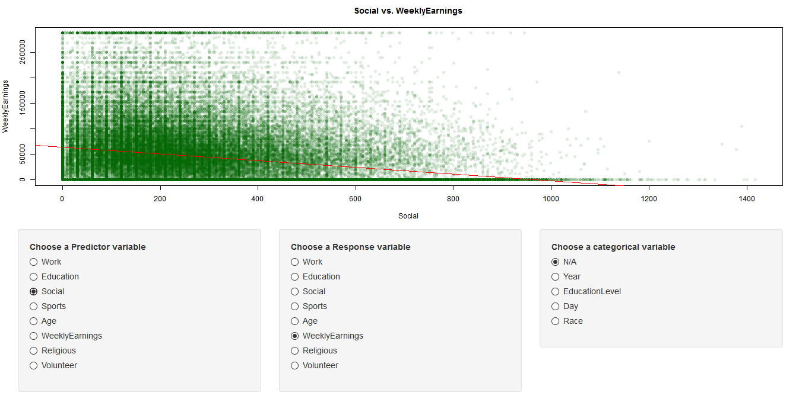

```{r setup, include=FALSE}
knitr::opts_chunk$set(echo = TRUE)
```

# American Time Use Survey (ATUS) Shiny App


## Intro

We have created a Shiny App that helps visualize certain aspects of the American Time Use Survey (ATUS) from 2003 - 2015. The ATUS measures the amount of time people spend doing various activities, such as paid work, childcare, volunteering, and socializing.  There are multiple data sets in the ATUS survey; we primarily used the activity summary data set and the cps data set which provided data about the respondents. 


## Statistical Concepts Used 

For the app, we wanted to both explore correlations between variables and regional data. For this we created a map of the United States with multiple options to view different statistics based on state. The map allows users to look at a few general demographics we thought would be interesting, as well as a map that uses education level and average hours worked by state.  We also have a tab that plots certain variables against each other to allow a user to see correlation, or lack thereof, between variables. This plot will also plot a regression line to see if the correlation that exists between the two variables is positive or negative. In addition, we will plot relationships between two variables and then cluster based on them, so the user can see organization within the data.


## Tabs 

### National Map Tab

The first tab is an map of the US, with the option of selecting between two maps. There is a radio button beneath the map to toggle between two plot options. We used the google charts package to plot them so they were interactive- hovering the mouse over each state reveals the name of the state and the percentage/number for the selected data in that state. The headers are also reactive, and change to match the data and the range of data being displayed

#### Participant Demographics Plot
The first plot can be used to explore the demographics of the participants and comparing statistics between states. We thought that before trying to examine the data, it was important to know where and who the data was coming from. The user can look at general number of survey participants in each state, the percentage of state population participating, percentage of those participating with bachelors degrees, and average age of participants. There is also a slider to adjust the range of ages to look at. Something interesting we realized was that, of the people surveyed, alaska had the highest percentage of 15 year olds with bachelor's degrees (we don't have to add this..)

#### Education Plot
Another relationship we found interesting to compare between states is education level and average number of hours worked per week. The user can select with radio buttons which category of education level to view on the map, and compare averages between states. An example of something interesting we found was that for people with only some college (no degree) in Montana worked much longer hours than people in other states of the same category, which is made clear by the much darker shade. Another trend we noticed by using the map is people who do not have a high school diploma tend to work more per week on average in the lower states than in the upper states (shown below).

#### Average Hours Worked Per Week of Non-High School Graduates


### Clustering Tab
The Clustering tab produces a scatter plot of a selected predictor variable and a selected response variable, and then does a k means cluster on them and colors each point by which cluster it belongs to. This allows the user to visualize the data in a colorful way and see natural separations in the data they may not see otherwise. For example, the plot of Age vs. Weekly Earnings allows us to see the main separation in data is in the earnings, and to see different 'tiers' of earners.


### Regression Tab
The regression tab allows the user to plot a predictor variable vs. a response variable. The predictor variable can either be categorical or quantitative, while the response may be quantitative. If the predictor is categorical, then the tab will produce a bar graph of means for all levels of the categorical variable, which is what a regression would predict. If quantitative, then it will produce a scatter plot of the two variables and a fitted regression line of the two. This allows the user to see if there exists positive or negative correlations between sets of variables. For example, one can see the negative correlation betwen time spent socializing and earnings (gulp!) below:  




## Conclusion

The general trends we found in ATUS data were not unexpected. In addition to discovering a negative correlation between time spent socializing and earnings, we also noticed a negative correlation between time spent socializing and education. When examining the EducationLevel vs WeeklyEarnings, there was a clear increase in weekly earnings as level of education increased.  

____/3 Provides an overall conclusion (Report)
____/3 Explains results (Report)


